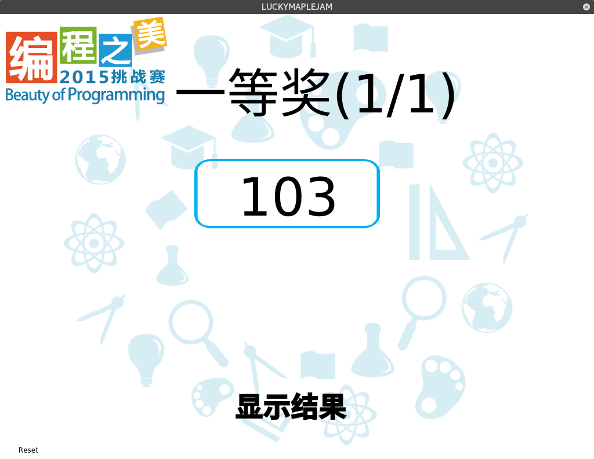

# LuckyMapleJam

一个欢乐的抽奖器

___

本抽奖软件曾在**微软学生夏令营**，**编程之美**以及**微软Hackathon**等活动中得到使用:-)

支持Windows和Linux平台, 需要使用**Qt**编译

你可以修改参与抽奖的人数，抽奖窗口的背景及标题等参数, 配置文件为`Data/config.ini`

如果有什么问题，欢迎到Issue中提出!



抽奖号码动画：


## 编译方法

安装[Qt](www.qt.io)

使用Qt打开`Lucky.pro`文件后，点击左下角的绿色三角形即可编译。

需要注意的是，Qt默认使用动态编译，如果要让程序在其他电脑上运行，需要从Qt的安装目录复制一些DLL文件到程序所在文件夹中。

## 如何保证抽奖的公平性

假设设定程序开始运行的时间为随机种子后，C++的`rand()`函数是相对随机的。

参与抽奖的人数为`N`人，编号为：`0, 1, 2, 3, 4,..., N-2, N-1`

中奖的人的编号是`a`

通常的做法是：

```c++
a = rand() % N;
```

但这样做是不公平的，假设随机数取值范围为：`[0, 10)`

随机数不包括10, 有6个人参与抽奖。

那么前4个人的中奖概率更大。

为了解决这个问题，设：

```c++
maxr = floor(RAND_MAX / N) * N;
// floor 为“向下取整”函数
```

如果随机数`rand_num`小于`maxr`, 

```c++
a = rand_num % N;
```
否则重新获取一个随机数

具体实现请见`mainwindow.cpp`中计算中奖号码的函数(在第200行左右)：

```c++
int MainWindow::GetNewNum()
```

为了保障抽奖器的公平性，本项目使用**GPL许可证**。
